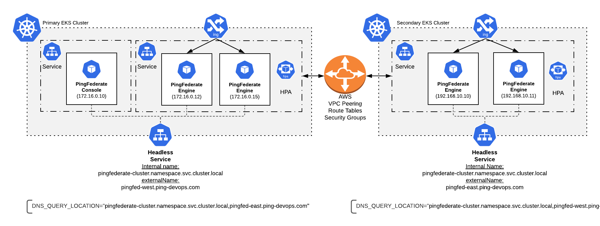

# Kubernetes Multi Region Clustering using DNS

This document is specific to dynamic discovery with DNS_PING and is an extension of [PingFederate Cluster Across Multiple Kubernetes Clusters](./deployK8sPFclusters.md). This is the recommended approach for PingFederate 10.2+

## Overview



The PingIdentity PingFederate Docker image default `instance/server/default/conf/tcp.xml` file points to DNS_PING. Once you have two peered Kubernetes clusters, to span a PingFederate cluster across becomes easy. A single pingfederate cluster using DNS_PING queries a local headless service. In this example we use [externalDNS](https://github.com/kubernetes-sigs/external-dns) to give an externalName to the headless service. externalDNS makes a corresponding record on AWS Route53 and constantly updates it with container ips of the backend PF engines.

!!! notes "External DNS"
    if unable to use [externalDNS](https://github.com/kubernetes-sigs/external-dns), another way to expose the headless service across clusters is needed. HAProxy may be viable.

## What You'll Do

- Edit the externalName of the pingfederate-cluster service and the DNS_QUERY_LOCATION variable as needed
  > search on the files for `# CHANGEME`
- Deploy the clusters
- Cleanup

## Running

### Prerequisites

- [PingFederate Cluster Across Multiple Kubernetes Clusters](./deployK8sPFclusters.md)
- externalDNS

Clone the `getting-started` [Repository](https://github.com/pingidentity/pingidentity-devops-getting-started) to get the Kubernetes yaml and configuration files for the exercise (20-kustomize/14-dns-pingfederate-multiregion), then:

1. Look through the files, there are embedded comments to explain the purpose of its structure.

1. Fix the first un-commented line under any `# CHANGEME` in the files. This will be the Kubernetes namespace and the will be the externalName of the pingfederate-cluster service.

1. Deploy the first cluster

    ```sh
    kubectl apply -f 01-east.yaml
    ```

1. Wait for the pingfederate-admin pod to be running, then validate you can log into the console. You can port-forward the admin service and look at clustering via the admin console.

    ```sh
    kubectl port-forward svc/pingfederate 9999:9999
    ```

1. If you have console access to AWS Route53, you should be able to find the externalName specified and see the IPs of your containers.

1. Switch Kubernetes context to second cluster

1. Deploy the second cluster

    ```sh
    kubectl apply -f 02-west.yaml
    ```

## Cleanup Clusters

```sh
kubectl delete -f 02-west.yaml
```

Switch Kubernetes context to second cluster

```sh
kubectl delete -f 01-east.yaml
```
